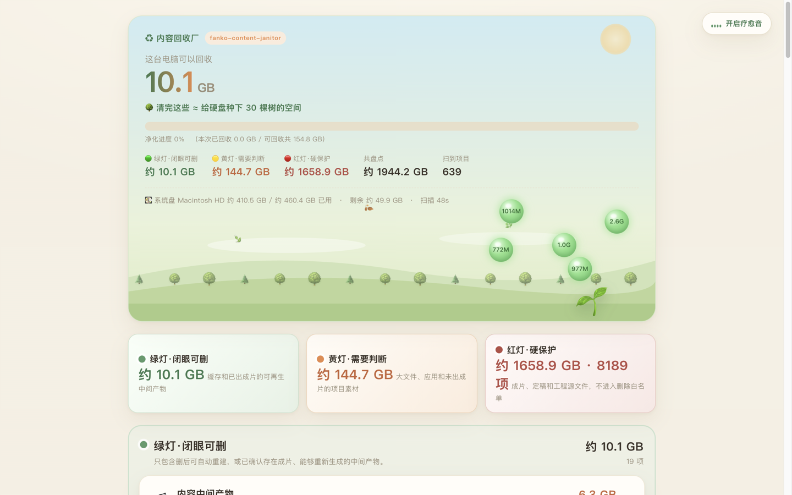

# ♻️ 内容回收厂 · Content Janitor

> 把「清电脑」做成一场蚂蚁森林——**扫出真正占空间的垃圾，点能量球收集，种一棵会长大的树。**
> A disk-cleaning agent skill that turns cleanup into an Ant-Forest game. Scan the real space hogs, collect energy orbs, grow a tree.

**中文** · [English](README.en.md)

[](./LICENSE)
[](#-快速开始macos)
[](#)


一个开源的 **Agent Skill / 独立脚本**，只读扫描你整台电脑真正占空间的垃圾，按「回收台」分类，用治愈的蚂蚁森林式网页让你**一键回收**。兼容 Claude Code、Codex 等支持 Agent Skills 的工具，也能当纯 Python 脚本直接跑。

<p align="center">
  
</p>

> 截图来自 2026-07-26 的真实全盘复扫。收紧「成片保险丝」后，未明确出片的项目从绿灯降为黄灯：绿灯 10.1 GB、黄灯 144.7 GB、红灯 1658.9 GB，共盘点 1944.2 GB。

## 📋 目录

[✨ 亮点](#-亮点为什么用它) · [🎯 它解决什么](#-它解决什么) · [⚔️ 和普通清理工具比](#️-和普通清理工具比) · [🚀 快速开始](#-快速开始macos) · [🗂 回收台分类](#-回收台分类) · [🔒 安全模型](#-安全模型) · [⚙️ 配置](#️-配置-channelsjson) · [🌟 关于作者](#-关于作者--fanko-ai-范式)

---

## ✨ 亮点（为什么用它）

- **🎮 清理 = 种树**：把枯燥的清垃圾做成蚂蚁森林——可回收的大项变成**发光能量球**浮在树周围，点一下收集 → 光带飞入 → 粒子迸开 → **中央大树长大一节**（🌱→🌿→🌳→开花）。清得越多，森林越茂盛。
- **🔍 扫的是真正的空间大头**：开发缓存（`~/.cache`、pip/npm/Xcode，常年十几 GB）、浏览器缓存、大下载、大应用——不是只扫几百 MB 的系统缓存。
- **🧾 全量记账，零隐形区**：每个字节都有去向——规则不认识的大块会被**递归钻取**（`drill_depth`）拆出成片与中间产物，钻不动的进「❓未归类」台面列给你；报告顶部「共盘点 X GB」可直接和磁盘已用对账（实测覆盖率 99%）。
- **🎬 独有「创作者维度」**：视频/剪辑项目里的中间产物（clips、图片序列、渲染临时文件）、重复的旧版本、失败渲染，别的清理工具扫不出来，这里一网打尽。给内容创作者和开发者。
- **🔒 安全第一，删不删你定**：全程**只读扫描**；重要文件（成片、定稿）**硬保护、永不删**；本地服务 + 路径白名单 + 随机 token + 仅 `127.0.0.1`；**不联网、不上传、无遥测**。默认「移废纸篓」可逆，「直接删」需二次确认。
- **🎵 疗愈环境音**：Web Audio 现场合成的柔雨/溪流 + 水滴风铃，边清理边放松（可关）。
- **🧩 零第三方依赖**：纯 Python 3 标准库 + 单个 HTML，离线可用。macOS 开箱即用。

---

## 🎯 它解决什么

电脑越用越满，但你**不知道什么在吃硬盘**，也不敢乱删。常见清理工具要么只扫系统缓存（几百 MB，杯水车薪），要么把一堆看不懂的开发缓存丢给你。

内容回收厂做三件事：**① 扫全**（通用磁盘大头 + 内容项目残留）→ **② 分级**（🟢闭眼可清 / 🟡需你判断 / 🔴保护不删）→ **③ 一键可逆回收**。删不删永远是你决定，它只负责把该看的都摆到你面前。

---

## ⚔️ 和普通清理工具比

| | CleanMyMac 等传统软件 | 只扫系统缓存的脚本 | ♻️ 内容回收厂 |
|---|---|---|---|
| **扫描范围** | 写死规则的系统/应用缓存 | 系统缓存（几百 MB） | 全盘真大头：开发缓存 / 大下载 / 大应用 **＋ 内容项目残留** |
| **创作者素材** | ❌ 不认识 clips / 渲染中间产物 | ❌ | ✅ 视频项目 clips / 图 / 重复旧版一网打尽 |
| **每项说明** | “缓存，可删”（不知道删了啥） | 无 | 具体路径 ＋ 类型 ＋ 删了的影响 ＋ 可逆性 |
| **决策权** | 半自动、规则写死 | 全手动 | **删不删你定**，成片/定稿硬保护永不删 |
| **隐私** | 闭源 / 可能联网 | — | 全程只读 ＋ 本地 ＋ 不联网 ＋ 开源可审计 |
| **体验** | 进度条 | 命令行 | 蚂蚁森林：收能量球、种树、疗愈音 |

---

## 🚀 快速开始（macOS）

```bash
# 1. 克隆
git clone https://github.com/fanko1217/content-janitor.git
cd content-janitor

# 2. 配置你的项目目录（可选，不配也能扫通用磁盘垃圾）
cp channels.example.json channels.json
#   用编辑器把 channels.json 改成你自己的视频/项目文件夹

# 3. 只读扫描（几秒，进度打在终端）
python3 scripts/scan.py > /tmp/janitor_analysis.json

# 4. 先验收三色结果，确认绿/黄/红三档都完整出现
python3 scripts/validate_report.py /tmp/janitor_analysis.json

# 5. 打开蚂蚁森林报告，网页上一键回收
python3 scripts/server.py /tmp/janitor_analysis.json
#   → 自动开浏览器；点能量球收集、点回收台按钮处置；用完 Ctrl+C 停

# 或只生成一份只读报告（无删除按钮，可分享/留存）
python3 scripts/build_report.py /tmp/janitor_analysis.json ~/Desktop/report.html
```

录制公开教程时，使用不会暴露浏览器标签、书签和私人路径的独立窗口：

```bash
JANITOR_PUBLIC_OUTPUT=1 python3 scripts/scan.py > /tmp/janitor_analysis.json
python3 scripts/validate_report.py /tmp/janitor_analysis.json
python3 scripts/server.py /tmp/janitor_analysis.json --recording-mode
```

录屏模式下，页面会隐藏用户名、外置盘名称和深层目录；录屏期间投进回收站的真实文件会临时暂存，停止服务时自动恢复原位。

> **作为 Agent Skill 用**：把本仓库放进 `~/.claude/skills/`（或你的 Agent 的 skills 目录），对 Claude Code / Codex 说下面任一句即可触发：
>
> ```
> 清理电脑   扫垃圾   磁盘满了   清出空间   哪些能删   清缓存   内容回收厂
> ```

---

## 🗂 回收台分类

扫描结果按 **bucket** 分成回收台，谁占得大谁排头条：

| 回收台 | 内容 | 判定 |
|---|---|---|
| 💾 开发/浏览器缓存 | pip/npm/uv/Xcode/`~/.cache`/Chrome 缓存 | 🟢 删了自动重建 |
| 🗑 死重量垃圾 | 废弃标记文件、失败渲染、临时/副本 | 🟢 零犹豫 |
| 🔁 重复件·旧版 | 同题多版本项目、`_v2`/`_copy` | 🟢 合并留最新 |
| 🎬 内容中间产物 | 已出成片项目的 clips/图（可重生成） | 🟢 可再生 |
| 📦 大下载 | Downloads 里的大文件 | 🟡 你定 |
| 📥 大应用 | `/Applications` 大体积应用 | 🟡 你定 |
| 🔒 成片/定稿 | 最终视频、定稿文本、工程源 | 🔴 硬保护，无删除按钮 |

---

## 🔒 安全模型

- **只读扫描**：`scan.py` 只跑 `du`/`listdir`/`glob`，绝不写。
- **成片零误删（双层红线）**：受保护文件的绝对路径构成保护集，`scan.py` 会剔除任何混入删除白名单的受保护路径；`server.py` 只接受本次报告明确列出的路径，且只允许位于用户目录、应用目录或已扫描外置盘。红灯永远不进入删除白名单。
- **本地服务**：绑定 `127.0.0.1` + 随机端口 + 随机 token + 校验 Host 头（防 DNS-rebinding）。每次删除浏览器先二次确认。
- **可逆优先**：默认「移废纸篓」，「直接删」是显式次选。
- **三色验收**：打开页面前先运行 `validate_report.py`；报告缺任意一档、任意统计数字或安全提示时立即停止。
- **公开录屏保护**：独立空白窗口不带个人浏览器信息，页面路径自动脱敏，录屏操作结束后自动还原暂存文件。

---

## ⚙️ 配置 `channels.json`

只有 `channels.json` 是你的私人配置（含真实项目路径），已被 `.gitignore` 忽略、不会误传。核心是每个频道的 `finished_globs`——判断一期是否已出成片的规则，**成片存在，其中间产物才允许被清**，没检测到成片就降级为「需你判断」，绝不赌。详见 `channels.example.json` 注释。

外置归档盘如果把 `finished_globs` 留空，会使用一组保守的
`auto_finished_globs` 自动寻找明确的成片视频。`project.json`、工程配置和定稿文稿
虽然仍受红灯保护，但不会被误当成“已经出成片”的证明。

---

## 🌟 关于作者 · Fanko AI 范式

这个工具来自 **Fanko AI 范式**——我（fanko）会亲手跑一遍 AI 方法，把真实过程、踩坑、提示词和 Skill 整理出来。每一期视频，都在公众号留下**可以直接复用的资料**。

关注公众号「**Fanko AI 范式**」，第一时间拿到每期的实操资料、提示词与开源工具更新：

<p align="center">
  <br>
  <sub>微信扫码关注 · <b>Fanko AI 范式</b></sub>
</p>

如果这个工具帮到了你，点个 ⭐ **Star** 就是最大的鼓励；有问题或想法，欢迎提 [Issue](../../issues) / [Discussion](../../discussions)。

---

## 🙏 致谢

本项目的四段式骨架（只读扫描 → 分级 → 交互报告 → 守卫式一键处置）学习并致敬 **[数字生命卡兹克 · storage-analyzer](https://github.com/KKKKhazix/khazix-skills)**（MIT）。在其磁盘缓存清理的基础上，本项目扩展了**内容创作者维度**（视频项目中间产物/重复旧版）与**蚂蚁森林游戏化**呈现。

## 📄 License

MIT © 2026 fanko
